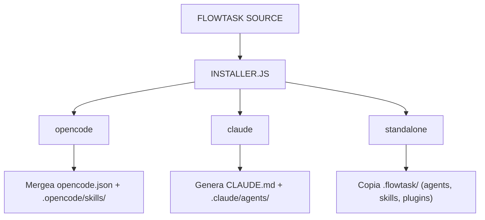

## 5. El Sistema de Instalación (Multi-Entorno)

Cómo FlowTask se "clona" a sí mismo para funcionar en diferentes entornos (OpenCode, Claude Code, Standalone).

```mermaid
flowchart TD
    SRC["FLOWTASK SOURCE"] --> INST["INSTALLER.JS"]
    INST --> OC["opencode"]
    INST --> CL["claude"]
    INST --> ST["standalone"]
    OC --> OCM["Mergea opencode.json + .opencode/skills/"]
    CL --> CLM["Genera CLAUDE.md + .claude/agents/"]
    ST --> STM["Copia .flowtask/ (agents, skills, plugins)"]
```
