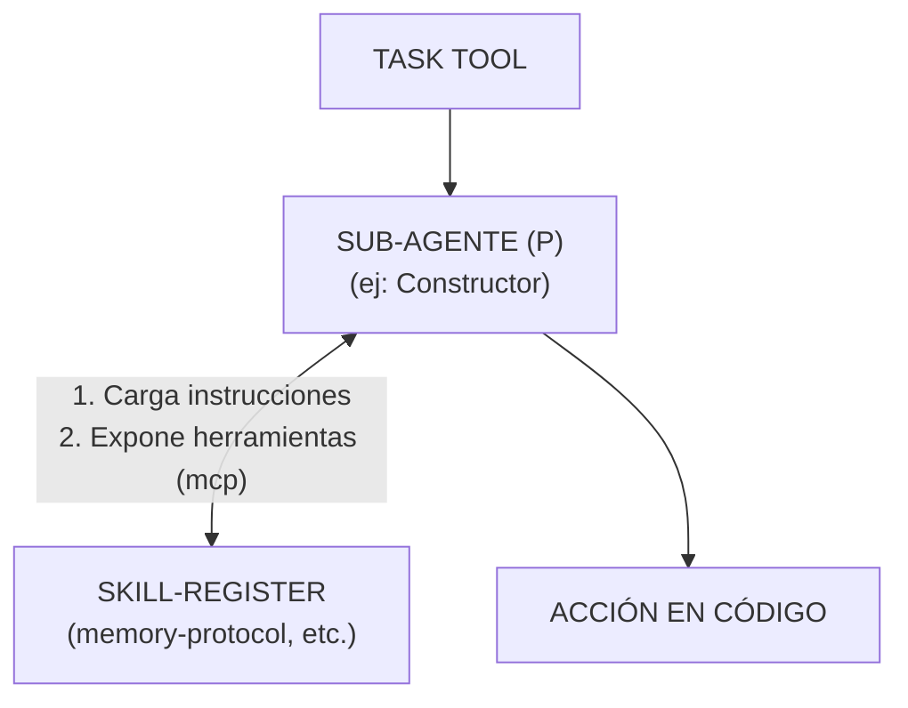

## 4. Integración de Skills (Modularidad)

Las Skills son el pegamento. Cuando un agente se activa, "carga" la skill necesaria para saber cómo usar las herramientas (como Engram).

```mermaid
flowchart TD
    TT["TASK TOOL"] --> SA["SUB-AGENTE (P)<br/>(ej: Constructor)"]
    SA <-->|"1. Carga instrucciones<br/>2. Expone herramientas (mcp)"| SR["SKILL-REGISTER<br/>(memory-protocol, etc.)"]
    SA --> AC["ACCIÓN EN CÓDIGO"]
```
