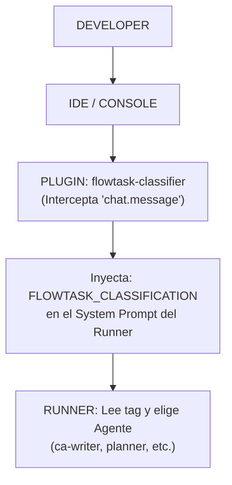

## 2. El Sistema de Clasificación (Plugin Link)

Cómo el plugin intercepta el mensaje antes de que el Runner lo procese, evitando que el Runner tenga que "adivinar".

```mermaid
flowchart TD
    DEV["DEVELOPER"] --> IDE["IDE / CONSOLE"]
    IDE --> PLUGIN["PLUGIN: flowtask-classifier<br/>(Intercepta 'chat.message')"]
    PLUGIN --> INJECT["Inyecta: FLOWTASK_CLASSIFICATION<br/>en el System Prompt del Runner"]
    INJECT --> RUNNER["RUNNER: Lee tag y elige Agente<br/>(ca-writer, planner, etc.)"]
```
